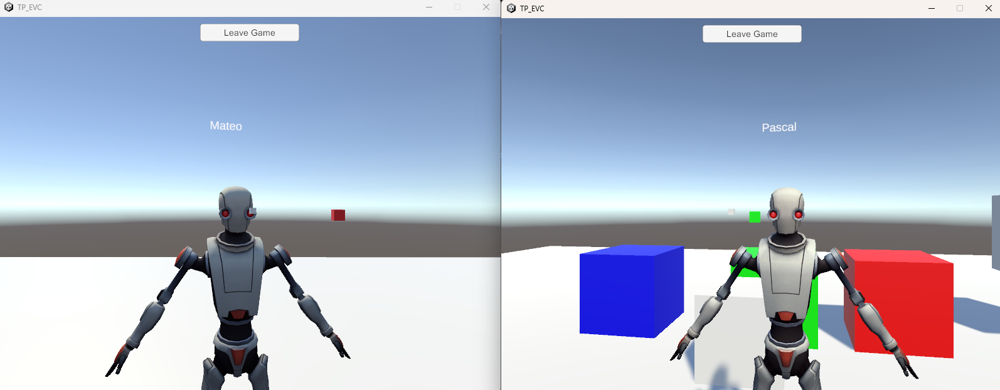

# Rapport du Projet : Environnement Virtuel Collaboratif

## Description du Projet
Ce projet, réalisé sous Unity, suit les étapes détaillées dans le tutoriel fourni.  
L'objectif principal était de développer un environnement virtuel collaboratif permettant à plusieurs joueurs de se connecter et d'interagir.

### Fonctionnalités Réalisées
- **Connexion Multi-joueurs** : Les utilisateurs peuvent intégrer l'environnement virtuel et interagir en temps réel.  
- **Manipulation d'Objets** : Les joueurs peuvent manipuler certains objets présents dans l'environnement à l'aide d'un curseur contrôlé par la souris.  
- **Identification des Joueurs** : Une amélioration personnelle a été apportée au projet pour afficher le pseudo ou le nom des joueurs au-dessus de leurs avatars, facilitant leur identification.

### Capture d'écran

## Environnement de Développement
- **Moteur** : Unity  
- **Version** : 2022.3.49f1

## Conclusion
Le projet respecte les objectifs initiaux définis dans le tutoriel tout en proposant une fonctionnalité supplémentaire pour enrichir l'expérience utilisateur.
